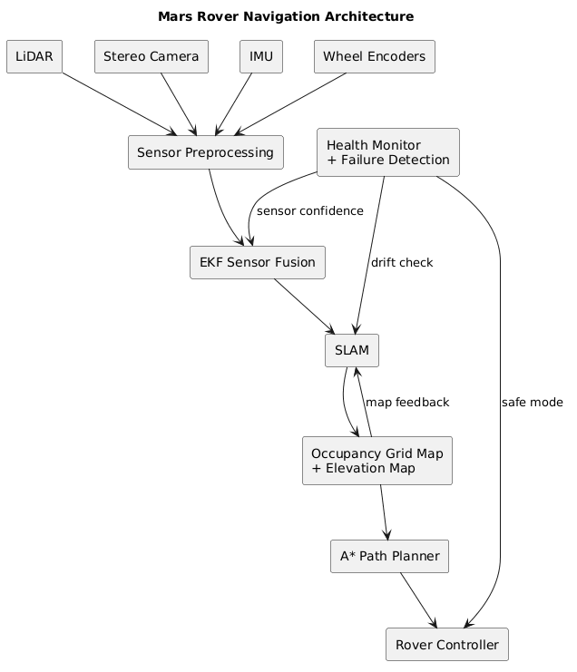

# Lost on Mars Case Study

This repository contains my solution for the RoboTeam Twente **Lost on Mars** software case study.

The case study has two parts:

1. Designing an autonomous navigation system for a Mars rover.
2. Fixing and improving a telemetry ring buffer implementation.

## Project Overview

The rover must navigate through outdoor terrain without GPS and without a live video feed.

The system design focuses on:

- real-time mapping
- localization
- sensor fusion
- wheel slip handling
- sensor failure recovery

The ring buffer part focuses on:

- fixed-size telemetry storage
- absolute sequence numbers
- overwritten data detection
- structured telemetry entries
- unit testing

## Repository Structure

```text
.
├── diagrams/
│   ├── diagram1.png
│   └── rover_navigation_architecture.puml
├── src/
│   ├── main/
│   │   └── java/
│   │       ├── RingBuffer.java
│   │       └── TelemetryEntry.java
│   └── test/
│       └── java/
│           └── RingBufferTest.java
├── Assignment1_Mars_Rover_Design.md
├── Assignment2_RingBuffer.md
├── pom.xml
├── .gitignore
└── README.md
```

## Assignment 1: Mars Rover Design

This part explains how the rover can:

- build a map of the terrain in real time
- estimate its own position and orientation
- continue operating when wheel slip or sensor noise occurs
- recover from localization drift or temporary sensor failure

The design uses LiDAR, stereo cameras, IMU, and wheel encoders.

The sensor data is fused using an Extended Kalman Filter.

SLAM is used for mapping and localization.

An occupancy grid map and elevation map are used for navigation.

A* path planning is used to find a safe route to the next waypoint.

## Rover Navigation Architecture



The architecture shows how sensor data flows through preprocessing, sensor fusion, SLAM, mapping, path planning, and rover control.

The health monitor checks sensor confidence, localization drift, and possible failures.

If the rover detects unreliable data, it can slow down, stop, or enter safe mode.

## Assignment 2: Telemetry Ring Buffer

This part analyzes and fixes the original ring buffer implementation.

The original `read()` method used only:

```java
sequenceNumber % capacity
```

This is not enough after the buffer wraps around.

Old sequence numbers may already be overwritten, but the original method can still return a value from the same index.

The fixed implementation checks whether a sequence number is still available before reading it.

## Java Implementation

The Java implementation includes:

- RingBuffer.java
- TelemetryEntry.java
- RingBufferTest.java

The buffer stores structured telemetry entries instead of raw integers.

Each telemetry entry contains:

- timestamp
- sensor ID
- float reading

## Testing

The project uses JUnit 5 tests.

The tests cover:

- normal write and read behavior
- wrap-around behavior
- overwritten sequence numbers
- unavailable future sequence numbers
- invalid capacity
- null telemetry entries
- structured telemetry entry values
- buffer size and total writes

All tests passed successfully in VS Code using JUnit 5.

## Running the Project

To compile manually:

```bash
javac src/main/java/*.java
```

To run tests with Maven:

```bash
mvn test
```

If Maven is not installed locally, the tests can also be run from an IDE such as VS Code or IntelliJ IDEA with JUnit support.

## Author

Kiarash Delavar
